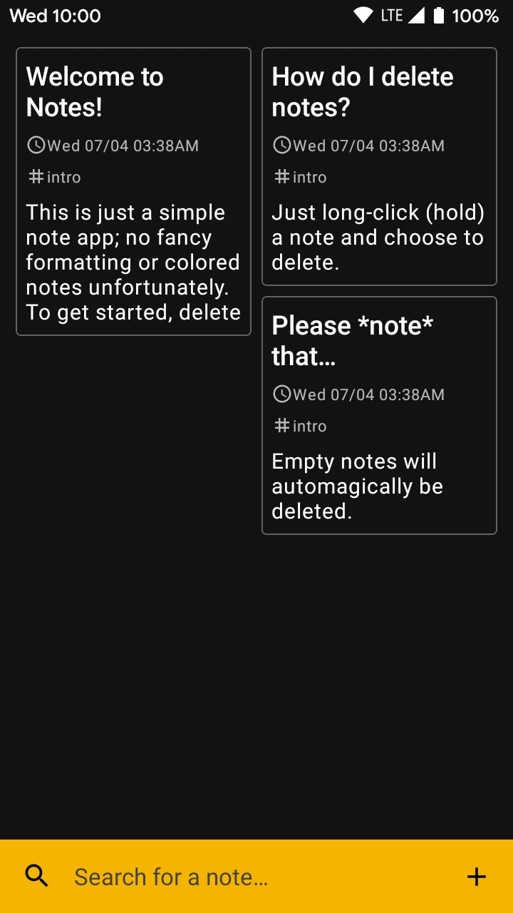
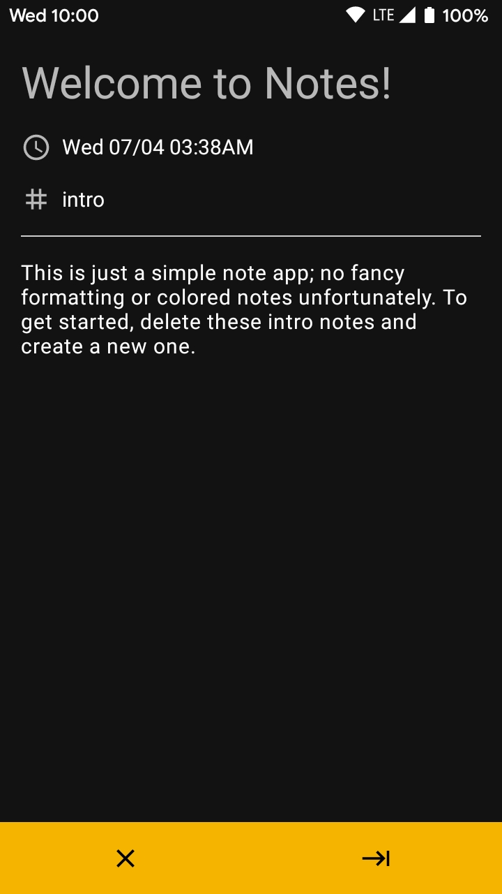
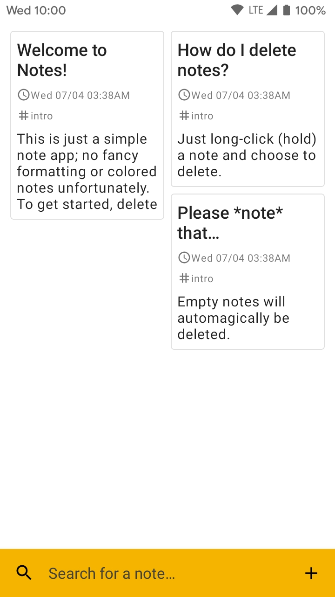

```
CSC13009 "Phát triển phần mềm cho thiết bị di động", Lớp 18CLC-KTPM2
G/v phụ trách: Trương Phước Lộc
18127221 Bùi Văn Thiện
```


# Báo cáo BT giữa kì: App ghi chú

### Tổng quan

Đây là một ứng dụng ghi chú cơ bản chạy trên nền tảng Android 5.0+ (một số thành phần trong giao diện, VD như giao diện sáng/tối, yêu cầu Android 9+ hoặc 10+.)

Ứng dụng cho phép người dùng tạo note, cũng như tìm kiếm note theo tựa đề/tag/nội dung.

Ứng dụng sử dụng các thành phần sau:

-   `androidx.room`: Room Database (hỗ trợ việc lưu trữ note cục bộ bên trong ứng dụng)
-   `androidx.lifecycle:lifecycle-viewmodel`: ViewModel (một thành phần của Lifecycle) hỗ trợ việc lưu giữ note cho fragment chính (danh sách note)

|   Giao diện màn hình chính    |    Giao diện chi tiết note    |
| :---------------------------: | :---------------------------: |
|   |   |
|  |  |


### Tự đánh giá

-   **Màn hình danh sách** `3.5 / 4.0`
    Màn hình danh sách note cho ta thấy tổng quan tốt của những note hiện tại, bao gồm xem trước nội dung của từng note (tối đa 5 dòng). Mốc thời gian sửa đổi lần cuối và dòng tag được hiển thị rõ và cùng thứ tự chiều dọc như màn hình chi tiết note. Một điểm trừ nhỏ ở đây là không thể tinh chỉnh danh sách note (VD: chuyển danh sách 2 cột về 1 cột, hay ẩn phần xem trước để tiết kiệm không gian trên màn hình nhỏ.)
-   **Màn hình chi tiết note** `2.0 / 4.0`
    Màn hình chi tiết note có phân biệt rõ giữa phần header (tiêu đề và thông tin khác) và nội dung của note. Tuy vậy, việc không có formatting hay tô màu nền sẽ làm cho note tương đối đơn điệu về mặt hình thức, vốn là một thiếu sót lớn so với yêu cầu đã đề ra.
-   **Lưu trữ** `1.5 / 1.5`
    Việc lưu trữ được quản lý bởi Room Database (SQLite dưới nền) thay cho SharedPreferences. Bên cạnh đó, những note trống (không có tiêu đề, tag và nội dung) sẽ được tự động xóa bỏ.
-   **Giao diện** `1.0 / 1.5`
    Giao diện đơn giản, không cầu kì, hỗ trợ tốt cả 2 tông trắng/đen, và được thiết kế để tiện tay sử dụng trên các điện thoại màn hình lớn (thanh công cụ chính nằm ở cuối màn hình). Tuy vậy, vẫn có một số form factor khác mà giao diện này chưa phát huy được sự tiện lợi của nó (VD: trên màn hình máy tính bảng nằm ngang, một danh sách các notes ở sidebar cùng với chi tiết note ở bên tay phải sẽ tận dụng không gian màn hình tốt hơn.)

